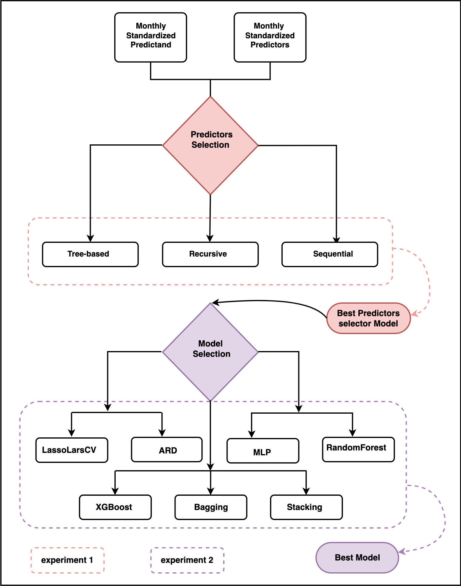

Methods
=======
The modeling steps and framework require to generate station-based downscaling products are explianed further here. The PP-ESD downscaling cycle involves technical and laborious steps that must be carefully 
addressed to ensure the robustness and accuracy of local-scale climate predictions. We provide more details on the various methods of the PP-ESD modelling routines

.. image:: ./imgs/outline1.png
   :width: 600
   :alt: Picture

Modelling framework
---------------------

- **Predictors construction and selections**
---------------------------------------------

The PP-ESD approach relies heavily on selecting the right predictors and learning models, as noted by Maraun et al. (2019) and Gutiérrez et al. (2019). 
These PP-ESD models are empirical, which means they use predictors as stand-ins for the various physical processes influencing the local climate. 
So, it's crucial that the chosen predictors provide enough information to capture the variability in what you're trying to predict.

To choose predictors wisely, it's essential to understand how the atmospheric variability in your study area. For instance, large-scale climate phenomena like atmospheric teleconnection patterns 
often dominate regional climate variations. Therefore, considering these as potential predictors is a good idea. To make the selection process manageable, you can employ statistical techniques, 
like feature selection or dimension reduction. These methods help trim down the list of potential predictors to a more manageable set of variables that show strong statistical relationships with 
what you want to predict. This not only improves the model's performance but also helps tackle issues like multicollinearity (when predictors are highly correlated) and overfitting (when the model 
fits the training data too closely).

In the pyESD package, you can explore three different wrapper feature selection techniques for various models:

1. **Recursive Feature Elimination:** This method, as explained by Chen and Jeong (2007), iteratively removes the least important predictors until the best subset is found.

2. **Tree-Based Feature Selection:** This technique, based on Zhou et al. (2021), uses decision trees to identify the most influential predictors.

3. **Sequential Feature Selection:** As described by Ferri et al. (1994), this method explores different combinations of predictors to find the most informative subset.

You can find these methods in the ``pyESD.feature_selection`` module under the names ``RecursiveFeatureElimination``, ``TreeBasedSelection``, and ``SequentialFeatureSelection``, respectively.

The predictor selection method is applied before training the model in the ``fit`` method by setting the predictor selector_parameter to True. The cal_relative_importance is set to True if the feature 
importance or explained variance of each predictor is computed (e.g.):
.. code-block:: python
   SO.fit(variable, date_range, predictor_data, fit_predictors=True, predictor_selector=True, 
                    selector_method=’Recursive’, selector_regressor="ARD", 
                    cal_relative_importance=False)

Note that the default fit method drops missing values and does not incorporate the information at 
these timestamps when calibrating the model due to their potential implications in interpreting the model. 
However, if users find merit in replacing the missing values, the impute parameter must be set to True, and 
the method should be specified (e.g., linear):

.. code-block:: python
   SO.fit(variable, date_range, predictor_data, fit_predictors=True, predictor_selector=True,
                            selector_method='Recursive', selector_regressor='ARD', impute=True, 
                            impute_method='linear')

Additionally, the pyESD package includes classical filter feature selection techniques, like correlation analyses, as part of the weather station object. These techniques help you identify predictors that correlate well with your predictand.
The predictor_correlation method of the station object is used for the correlation analysis:

.. code-block:: python
   corr = SO.predictor_correlation(variable, predictor_data, predictor_data, fit_predictor=True, 
                                 fit_predictand=True, method="pearson", use_scipy=True)

In practice, predictors are often created by either computing regional averages of relevant climate variables or constructing time series indices for significant large-scale climate phenomena.

- **Learning model selection** 
--------------------------------

The relationship between local climate predictions and large-scale factors is often intricate due to the complexities within the climate system. Machine Learning (ML) algorithms, 
however, have proven effective in uncovering hidden patterns in climate data. These patterns are crucial for constructing sophisticated models that can accurately predict local 
climate changes.
Neural networks, for instance, have gained attention in downsizing climate information. They excel at establishing complex, nonlinear connections between local predictions and 
large-scale factors. Support Vector Machine (SVM) models are another choice; they map low-dimensional 
data to high-dimensional feature spaces using kernel functions. This technique captures the intricate links between predictors and predictions.
Furthermore, some studies utilize multi-model ensembles to mitigate model variance and replicate the distribution of training data.
Selecting the right model or algorithm for a specific location or prediction can be challenging. Factors like data complexity, distribution, temporal resolution, and interpretability 
need consideration. Unfortunately, climate data downscaling lacks well-established frameworks.
The pyESD package tackles this challenge by offering a variety of ML models, each with distinct theoretical foundations, assumptions, and structures. This versatility empowers 
researchers to experiment with different models, replicate findings, and adapt to emerging recommendations for specific predictions and regions. Most of the statistical and ML models in 
pyESD are built upon the open-source scikit-learn framework.

**Here's a list of the regression models implemented in the provided Python code**:

1. **LassoCV**: Lasso regression with cross-validation.
2. **LassoLarsCV**: LassoLars regression with cross-validation.
3. **RidgeCV**: Ridge regression with cross-validation.
4. **ARD**: Automatic Relevance Determination regression.
5. **BayesianRidge**: Bayesian Ridge regression.
6. **Gamma**: Gamma Regressor (Generalized Linear Model).
7. **Poisson**: Poisson Regressor (Generalized Linear Model).
8. **MLP**: Multi-layer Perceptron Regressor (Neural Network).
9. **SVR**: Support Vector Regressor.
10. **RandomForest**: Random Forest Regressor (Ensemble Tree-Based Model).
11. **ExtraTree**: Extra Trees Regressor (Ensemble Tree-Based Model).
12. **Bagging**: Bagging Regressor (Ensemble Model).
13. **AdaBoost**: AdaBoost Regressor (Boosting Ensemble Model).
14. **HistGradientBoost**: Histogram Gradient Boosting Regressor (Gradient Boosting Ensemble Model).
15. **GradientBoost**: Gradient Boosting Regressor (Gradient Boosting Ensemble Model).
16. **XGBoost**: XGBoost Regressor (Gradient Boosting Ensemble Model).
17. **SGD**: Stochastic Gradient Descent Regressor.
18. **Stacking**: Stacked Generalization Ensemble
19. **MLR**: Multiple Linear Regression
20. **Dense**: Various Deep Learning models

These models cover a wide range of regression techniques, from traditional linear models to advanced ensemble methods and neural networks.

- **Learning model training and evaluation**
---------------------------------------------

The stage of training and testing PP-ESD models stands as a critical juncture in the downscaling process. It significantly 
influences the robustness of the final models and the accuracy of their predictions. This process typically involves the following steps:

1. **Data Splitting**: The observational records are divided into two sets - training and testing datasets.

2. **Training Transfer Functions**: The training datasets are used to create the transfer functions that constitute the PP-ESD models.

3. **Model Evaluation**: The models are then assessed using independent testing datasets.

In the model training phase, techniques like hyperparameter optimization (e.g., GridSearchCV) are employed to fine-tune parameters like 
regression coefficients. This optimization aims to enhance the model's performance. Cross-validation (CV) techniques come into play to break down 
the training dataset into smaller segments for iterative model assessment and improvement. These techniques also help guard against overfitting.

Among CV techniques, the k-fold framework is most commonly used in climate data downscaling models. It splits the training data into k equal and 
separate subsamples, often called "folds". In each iteration, one fold serves as the validation set, and the 
remaining k-1 folds form the training data. The leave-one-out CV technique offers an alternative and has been employed 
in ESD model development.

CV techniques rely on the assumption that the data is independent and identically distributed (i.i.d), treating it as if it's generated without memory 
of past samples. However, this assumption may not hold for time series data due to seasonal effects, for instance. To address 
this, the pyESD package incorporates monthly-bootstrapped resampling and time-series splitters.

The ``pyESD.splitter`` module includes various CV frameworks for model training, such as k-fold, leave-one-out, and others. Validation metrics, like the coefficient of determination (R2), 
Root Mean Squared Error (RMSE), Mean Absolute Error (MAE), and more, are used to optimize model parameters. The final values for these metrics, reflecting the model's 
performance during training, are the arithmetic means across all iterations. In this paper, we refer to them as CV performance metrics (i.e., CV R2, CV RMSE, and CV MAE).
The model is defined in the set_model method, with the method parameter as the model name listed above. The cost function for training 
the model is also defined in the scoring parameter, and the splitter to use for cross-validation is defined by the CV parameter. In case the regressor used is 
the ensemble method, then ensemble learning must be defined as True (e.g.):

.. code-block:: python
   SO.set_model(variable, method=”Stacking”, ensemble_learning=True, 
                     estimators=base_estimators, final_estimator_name=final_estimator, daterange=from1958to2010, predictor_dataset=ERA5Data, cv=KFold(n_splits=10),
                     scoring = scoring)

- **Coupling of the transfer function to GCMs**
------------------------------------------------

Once the PP-ESD model has been developed and tested, it can be integrated with coarse-scale climate information. 
If the intention behind the PP-ESD model is to downscale predictions for future climate scenarios, the next logical step is coupling it with General 
Circulation Model (GCM) simulations driven by different greenhouse gas concentration scenarios. PP-ESD, being a bias-free downscaling method, offers 
flexibility by being compatible with various GCMs, provided that the GCMs adequately represent the predictors. To address this, standardizing the simulated 
predictors can help. An analysis can be performed to assess the similarity in the distribution of observed and simulated predictors. For 
instance, the Kolmogorov-Smirnov (KS) test, available as part of the pyESD package utilities, can be used to test the null hypothesis (H_0) that observation-based 
and simulated predictors follow the same theoretical distribution.

The coupling of ESD with GCMs involves several steps:

1. **Recreating Predictors**: Utilize GCM output to recreate the predictors used during the training of the ESD model. This process may 
range from constructing simple regional temperature means to reconstructing more complex climate phenomena through multivariate indices.

2. **Index-Based Predictors**: For indices like NAO, EA, SCAN, and others, simulate the indices by projecting GCM pressure anomalies 
onto the Empirical Orthogonal Function (EOF) loading patterns of the predictors. This ensures that the 
physical meaning of the index values is preserved.

3. **ESD Model Application**: The ESD model takes these simulated predictors as input and generates local-scale predictions using its transfer functions.

4. **Assessing Added Value**: Evaluate the added value of the downscaled product by comparing it to the raw outputs of different GCMs and Regional Climate Models (RCMs).

5. **Applications**: Utilize the high-resolution local-scale predictions to drive climate change impact assessment models. These predictions can inform various assessments, 
such as flood frequency prediction, agricultural impact assessments, changes in water resources, and more.

This integration bridges the gap between large-scale climate models and fine-scale local predictions, enabling informed decision-making in various sectors impacted by climate change.
The future predictions are generated using the predict method with the simulated predictors as input data:

.. code-block:: python
   #print("predicting based on the RCP 2.6 predictors")
   yhat_CMIP5_RCP26_R1_anomalies = SO.predict(variable, fullCMIP5, 
                                        CMIP5_RCP26_R1, fit_predictors=True, fit_predictand=True,
                                        params_from="CMIP5_AMIP_R1", patterns_from= "CMIP5_AMIP_R1")

